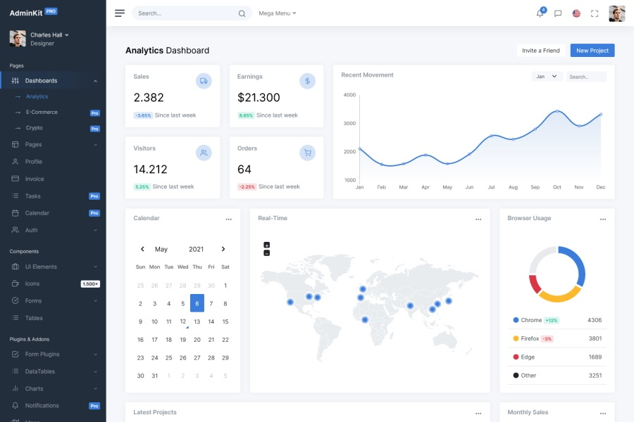

# UI Design for Data Visualization

To display how much students are using the product, we would use a dashboard-style UI that features graphs and filtering options for administrators to easily explore the data. Below is an overview of the UI design and technologies that would be used to create it.

## UI Mockup

### Dashboard Overview:

- **Graph 1**: A bar chart showing average time-on-task per class. Each bar represents a class, and the height indicates the average time students in that class spent using the product.
- **Graph 2**: A line chart showing time-on-task trends over time for selected classes. This allows the user to observe fluctuations in usage.
- **Graph 3**: A pie chart representing the distribution of total usage across different classes, giving a snapshot of which classes are using the product the most.
- **Filters**: Dropdowns and multi-select options to filter by institution, class, date range, and specific tasks.
- **Table View**: A detailed view of time-on-task per student, with sorting and search functionality.

### Interactivity:

- **Clicking on a class** in any graph would drill down to show individual student usage within that class.
- **Hovering over data points** on the line chart would provide more detailed information.
- **Filters** would update all graphs dynamically without requiring page reloads.

## Technologies

- **AdminKit**: To provide a pre-designed, professional-looking UI for the admin dashboard. AdminKit can be adapted for React to speed up development and provide consistent styling.
- **React**: For building reusable, interactive UI components. React is highly efficient in rendering UI changes, making it ideal for a dynamic dashboard.
- **React Router**: To enable navigation between different views of the dashboard, such as an overview and detailed per-class or per-student views.
- **Redux Toolkit**: To manage the state of filters, data, and UI state across components. This ensures that filter changes are propagated correctly across multiple charts and tables.
- **React Context API**: Could be used for lighter global state, especially for passing user preferences and settings.

## Performance Enhancements

- **Memoization**: Use memoization (e.g., `React.memo` or `useMemo`) to prevent unnecessary re-renders of charts and components that do not need updates when unrelated state changes.
- **Lazy Loading**: Implement lazy loading for data-heavy components and charts to reduce the initial load time of the dashboard.
- **Debouncing**: Use debouncing for filtering and search inputs to prevent the app from making frequent requests while the user is typing.
- **Pagination**: For the table view, use pagination to limit the number of rows rendered at once, improving performance.

## Security Considerations

- **Authentication & Authorization**: Use OAuth or JWT-based authentication to ensure that only authorized administrators can access the dashboard.
- **Data Protection**: Ensure all API calls are made over HTTPS to protect sensitive data. Additionally, apply proper access controls to prevent unauthorized data access.
- **Input Validation**: Validate user inputs, such as filter values, to prevent injection attacks.
- **Rate Limiting**: Implement rate limiting on API endpoints to prevent abuse and potential denial-of-service (DoS) attacks.
